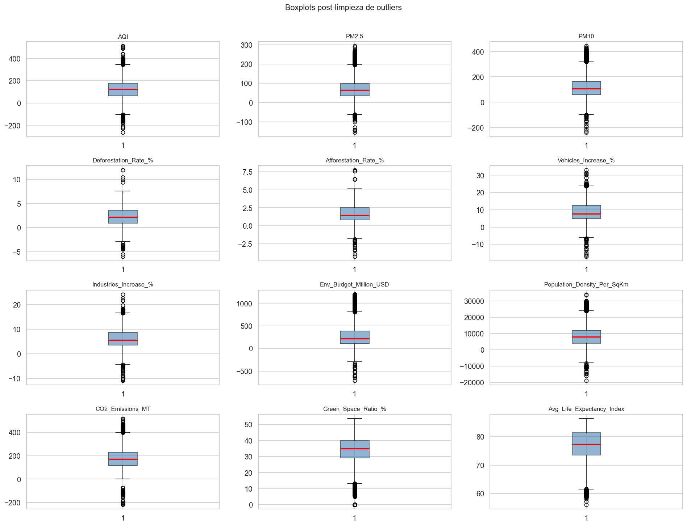
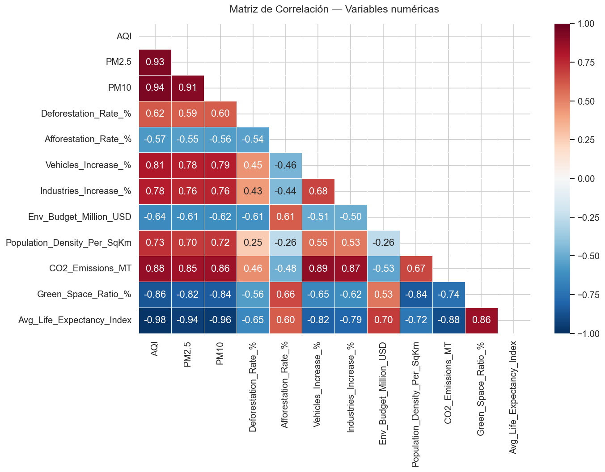
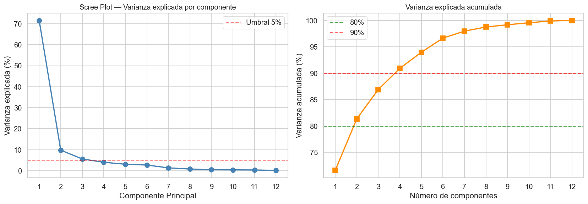
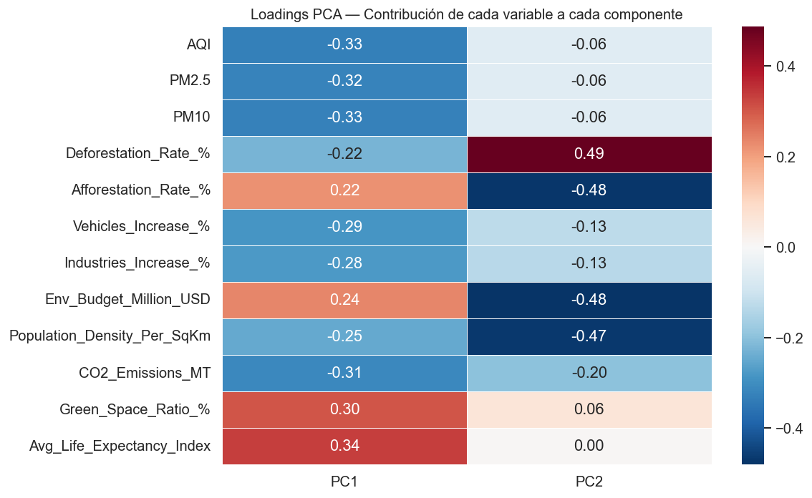
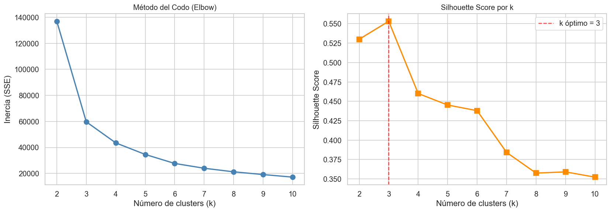
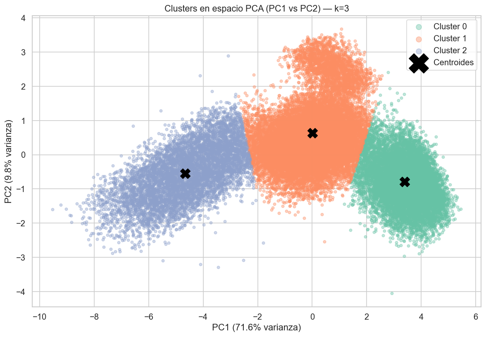
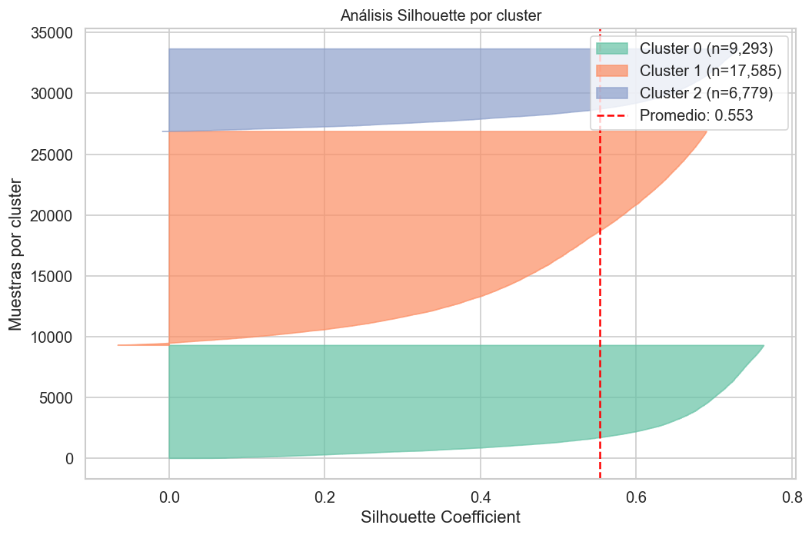
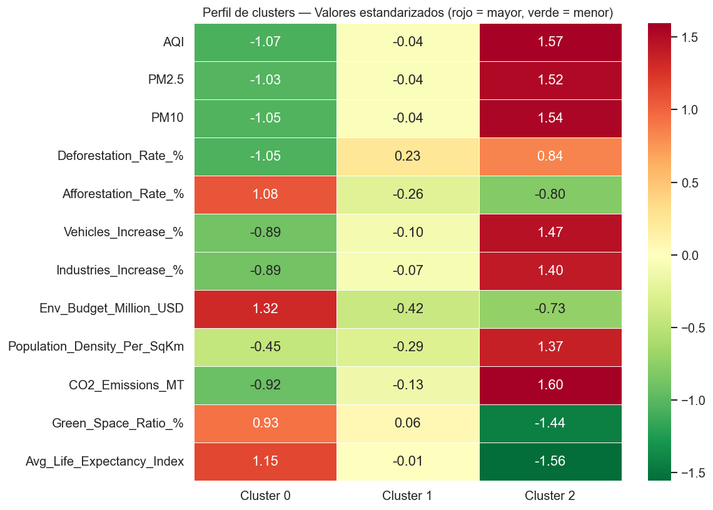
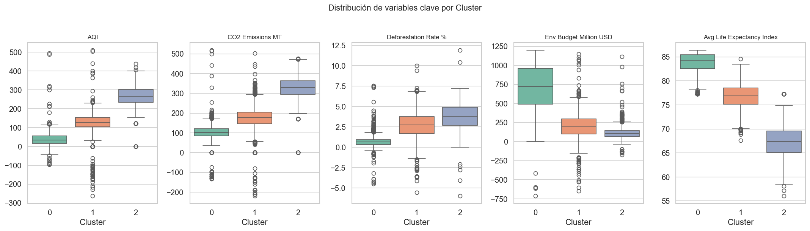

# PCA + K-Means Clustering — Global Air Quality

Análisis de calidad del aire global mediante reducción de dimensionalidad (PCA) y segmentación no supervisada (K-Means).

**Dataset:** [Global Air Quality and Respiratory Health Outcomes](https://www.kaggle.com/datasets/tfisthis/global-air-quality-and-respiratory-health-outcomes) — 36 437 registros originales · 15 variables · 10 años (2014–2023) · 50 países · 100 ciudades.

---

## Resultados principales

| Métrica | Valor |
|---------|-------|
| Filas tras limpieza | 33 657 |
| Componentes PCA seleccionados | 2 (explican **81.34 %** de varianza) |
| Clusters encontrados | **3** |
| Silhouette Score | **0.5532** |

### Clusters identificados

| Cluster | n | AQI promedio | CO₂ (MT) | Esperanza de vida | Presupuesto ambiental (M USD) | Perfil |
|---------|---|-------------|----------|-------------------|-------------------------------|--------|
| **0** | 9 293 | 38.7 | 103 | 83.9 | 724 | Baja contaminación / alta inversión |
| **1** | 17 585 | 128.7 | 175 | 76.8 | 200 | Contaminación moderada |
| **2** | 6 779 | 268.8 | 329 | 67.2 | 106 | Alta contaminación / baja inversión |

Países representativos por cluster:
- **Cluster 0:** Australia, España, Suecia, Japón, Francia
- **Cluster 1:** Rusia, Perú, Marruecos, Indonesia, Etiopía
- **Cluster 2:** Egipto, Bangladesh, Irán, Pakistán, Myanmar

---

## EDA — Exploración de datos


### Outliers (boxplots post-limpieza)



Se aplicó criterio **3×IQR** para la detección de outliers. Se eliminaron 1 343 filas (3.84 % del total). La variable con más outliers removidos fue `Avg_Life_Expectancy_Index` (261 casos).


---

## Análisis de correlación



Se observa alta correlación positiva entre `AQI`, `PM2.5`, `PM10` y `CO2_Emissions_MT`, lo que confirma que PCA puede comprimir esas dimensiones sin perder información relevante. `Env_Budget_Million_USD` y `Avg_Life_Expectancy_Index` correlacionan negativamente con los indicadores de contaminación.

---

## PCA

### Varianza explicada



- **PC1** explica el 71.6 % de la varianza (domina la dimensión contaminación/salud).
- **PC2** suma el 9.8 % adicional (diferencia variables de cobertura forestal y densidad poblacional).
- Con solo **2 componentes** se captura el **81.3 %** de la información total.

### Loadings



PC1 está dominado por `AQI`, `PM2.5`, `PM10`, `CO2_Emissions_MT` (positivo) y `Env_Budget_Million_USD`, `Avg_Life_Expectancy_Index`, `Green_Space_Ratio_%` (negativo): representa el eje **contaminación vs. bienestar ambiental**.

---

## K-Means

### Selección de k



El Silhouette Score alcanza su máximo en **k=3** (0.5532), coincidiendo con el codo visible en la curva de inercia.

### Clusters en espacio PCA



Los tres clusters se separan limpiamente a lo largo de PC1. Las fronteras son claras, lo que confirma la calidad del agrupamiento.

### Análisis Silhouette por muestra



Los tres clusters superan el promedio (0.553), sin clusters con coeficientes mayoritariamente negativos.

---

## Perfilado de clusters

### Heatmap de perfiles (valores estandarizados)



El gradiente rojo-verde permite identificar de un vistazo las variables que diferencian cada cluster: el Cluster 2 es consistentemente rojo en contaminantes y verde en bienestar; el Cluster 0, al revés.

### Variables clave por cluster



Las distribuciones de `AQI`, `CO2_Emissions_MT` y `Avg_Life_Expectancy_Index` son las que mejor separan los tres grupos, con rangos intercuartílicos sin solapamiento entre clusters extremos (0 y 2).


---

## Estructura del proyecto

```
ciencia_datos_airquality/
├── pca_clustering_airquality.ipynb   # Notebook principal (pipeline completo)
├── global_air_quality.csv            # Dataset fuente
├── data.py                           # Descarga el dataset desde Kaggle vía kagglehub
└── images/                           # Gráficas exportadas (generado al ejecutar el notebook)
```

---

## Requisitos e instalación

```bash
pip install numpy pandas matplotlib seaborn scikit-learn kagglehub
```

### Descargar el dataset

```bash
python data.py
```

Copia el CSV resultante a la raíz del proyecto como `global_air_quality.csv`.

### Ejecutar el notebook

```bash
jupyter notebook pca_clustering_airquality.ipynb
```

Ejecutar todas las celdas en orden (`Kernel > Restart & Run All`). La carpeta `images/` se crea automáticamente y contiene las 12 gráficas exportadas.
